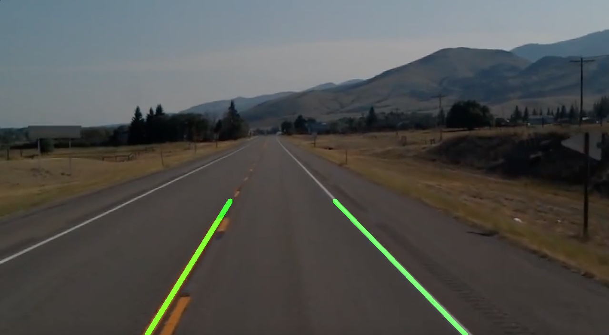

# Project description
This is lane detection algorithm written with python programming language with the aid of OpenCV library. This code is tested using to models; static image, and video
recorded using camera mounted on a moving car

## Results
### Static Image

### Video output

